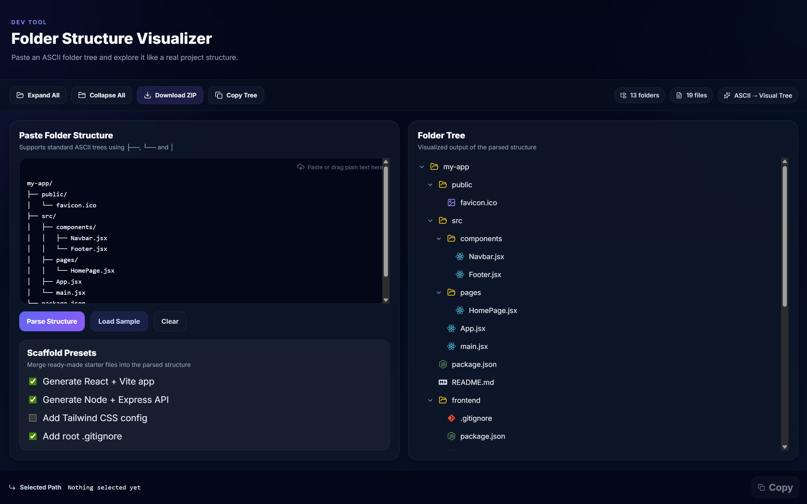

# 📁 Folder Structure Visualizer

**Folder Structure Visualizer** is a developer tool that converts ASCII folder trees into an interactive visual explorer and allows exporting the structure as a downloadable scaffold ZIP.

Instead of manually creating dozens of folders and files when starting a project, you can paste a tree structure and generate the entire scaffold instantly.

---

## ✨ Features

- **📂 ASCII → Visual Tree**
  Paste a standard ASCII folder tree and instantly visualize it.

- **🌳 Collapsible Folder Explorer**
  Expand or collapse folders like a real file explorer.

- **📊 File & Folder Counters**
  Automatically counts total files and directories.

- **📋 Copy Path**
  Click any file or folder and copy its full path.

- **📄 Copy Tree as Markdown**
  Export the folder structure as Markdown.

- **📦 Download Project Scaffold**
  Generate and download a ZIP containing the entire folder structure.
  - **⚛️ React + Vite Preset**
    Instantly generate a ready-to-run React + Vite frontend scaffold.

- **🎨 Tailwind CSS Preset**
  Add Tailwind CSS configuration and generate a styled starter homepage.

- **🟦 TypeScript (TSX) Preset**
  Generate TSX-based React scaffolds with `App.tsx`, `main.tsx`, `vite.config.ts`, and TypeScript config files.

- **🧩 Node + Express Preset**
  Generate a backend starter with Express and a clean folder structure.

- **🖥 Custom Starter Screens**
  Generated React scaffolds include a branded startup homepage with setup instructions.

- **⚠️ Vite 8 Node Warning**
  Generated frontend scaffolds show a built-in Node.js version warning for Vite 8 compatibility.

- **🚫 Smart Ignore Rules**
  Automatically filters out generated folders like
  `node_modules`, `dist`, `build`, `.next`, and `coverage`.

- **🖱 Drag & Drop Input**
  Drop ASCII trees directly into the editor.

- **🧠 Flexible Parsing**
  Supports both standard ASCII trees (├──, └──, │) and indentation-based structures.
  Indentation is only valid under folders (lines ending with /).

---

## 🖼 Preview

<p align="center">
  
</p>

### Input

```text
my-app/
├── public/
│   └── favicon.ico
├── src/
│   ├── components/
│   │   ├── Navbar.jsx
│   │   └── Footer.jsx
│   ├── pages/
│   │   └── HomePage.jsx
│   ├── App.jsx
│   └── main.jsx
├── package.json
└── README.md
```

### Result

This becomes an **interactive visual tree** inside the UI.

---

## 📦 Scaffold Export

The **Download ZIP** feature creates a project scaffold where the ZIP file is automatically named after your **root folder**.

> ⚠️ **Important**
> All files are generated as **empty files**, allowing developers to start coding immediately without manually creating folders and files.

### Included Scaffold Presets

The scaffold system can optionally generate starter files for:

- **React + Vite**
- **React + Vite + Tailwind CSS**
- **React + Vite + TypeScript (TSX)**
- **React + Vite + TypeScript (TSX) + Tailwind CSS**
- **Node + Express API**
- **Root `.gitignore`**

## These presets are merged into the parsed folder tree and exported as part of the ZIP.

---

## 🛠 Tech Stack

- **Framework:** React (Vite)
- **Languages:** JavaScript, TypeScript
- **Styling:** CSS, Tailwind CSS
- **Backend Preset:** Node.js, Express
- **Icons:** Lucide React & React Icons
- **ZIP Generation:** JSZip

---

## ⚛️ Generated Frontend Presets

When scaffold options are selected, the exported ZIP can generate frontend starter projects with:

### JSX Preset

- `App.jsx`
- `main.jsx`
- `vite.config.js`

### TSX Preset

- `App.tsx`
- `main.tsx`
- `vite.config.ts`
- `vite-env.d.ts`
- `tsconfig.json`
- `tsconfig.app.json`
- `tsconfig.node.json`

### Tailwind Support

When Tailwind is enabled, the scaffold also includes:

- `tailwind.config.js`
- `postcss.config.js`

### Vite 8 Compatibility Note

Generated frontend starter pages include a visible warning that Vite 8 requires:

- **Node.js 20.19+**, or
- **Node.js 22.12+**

---

## 🚀 Installation

Clone the repository:

```bash
git clone https://github.com/<your-username>/folder-structure-visualizer.git
```

Navigate into the project:

```bash
cd folder-structure-visualizer
```

Install dependencies:

```bash
npm install
```

Start the development server:

```bash
npm run dev
```

Open in browser:

```
http://localhost:5173
```

---

## 🧠 How It Works

1. **Input** – User pastes an ASCII folder tree.
2. **Parsing** – The parser converts the text into a nested JSON data structure.
3. **Visualization** – The UI renders the structure as a collapsible file explorer.
4. **Action** – The structure can then be:
   - copied as Markdown
   - explored visually
   - exported as a ZIP scaffold (ignoring build artifacts)

---

## 🎯 Use Cases

- **Quick Scaffolding** – Set up new projects in seconds.
- **Repo Visualization** – Understand complex repository structures instantly.
- **Architecture Sharing** – Share project designs with teammates.
- **Documentation** – Generate clean trees for README files.
- **Preset-Based Project Bootstrapping** – Generate React, TSX, Tailwind, and Express starter structures instantly.

---

## 🔮 Future Improvements

- [ ] README auto-generation for exported projects
- [ ] Preset variants (Minimal / Standard / Production-ish)
- [ ] Custom starter pages and branding options
- [ ] Export GitHub-ready repository metadata

---

## 📜 License

This project is licensed under the **MIT License**.

---

## 👨‍💻 Author

**Farhaan Khan**
Computer Science Engineering student passionate about building developer tools and learning through projects.

---

## ⭐ Support

If you found this project useful, consider **starring the repository** to support development!
